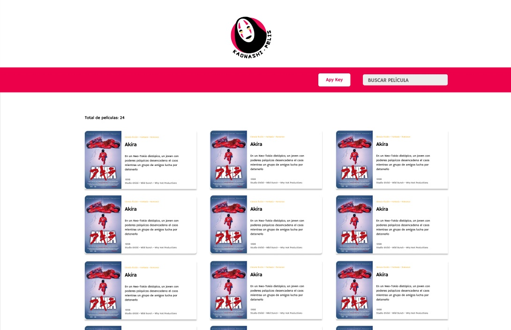

# Dataverse chat

## Índice

* [1. Introducción](#1-introducción)
* [2. Historias de usuario](#2-historias-de-usuario)
* [3. Diseño de la interfaz de usuaria](#3-diseño-de-la-interfaz-de-usuaria)
* [4. Funcionalidades](#4-funcionalidades)
* [5. Consideraciones técnicas](#5-consideraciones-técnicas)
* [6. Test](#6-test)

***

## 1. Introducción

En este proyecto se tomara como base la aplicación desarrollada
en [Dataverse](https://github.com/CB97103/DEV012-dataverse "Dataverse"),  la cual cuenta con una vista y mantiene funcionalidades como visualización, filtrado, ordenación y cálculo de estadísticas. El objetivo es evolucionarla hacia una Aplicación de Página Única (SPA), incorporando nuevas vistas para consultar información detallada de cada película. Además, se añadirá la capacidad de interactuar con un personaje de la película seleccionada a través de un sistema de chat impulsado por la API de OpenAI.

## 2. Historias de usuaria

- Como amantes de las películas de animación japonesa, queremos buscar información detallada sobre cada película para conocer sus características.

- Deseamos filtrar películas por nombre, estudio de animación y año para encontrar fácilmente la información deseada.

- Queremos ordenar películas en forma ascendente o descendente según nuestras preferencias.

- Como amante de las películas de animación japonesa quiero conocer más acerca de las películas interactuando con los personajes

## 3. Diseño de la interfaz de usuaria

#### Prototipo de baja fidelidad


Se comenzó creando el prototipo para móvil, lo que facilitó la comprensión de las necesidades de la usuaria y la forma en que se desplazaría por la aplicación.


#### Prototipo de alta fidelidad


Para el prototipo en alta fidelidad, se ha definido una paleta de colores distintiva que será característica de la página.



## 4. Funcionalidades

Este proyecto se concibe como una Aplicación de Página Única (SPA) que brindará al usuario la capacidad de visualizar, filtrar, ordenar y calcular estadísticas sobre la información disponible. Además de estas funcionalidades generales, la aplicación facilitará el acceso a una página detallada para cada película.

Utilizando la API de OpenAI, la aplicación permite a los usuarios entablar conversaciones interactivas con un personaje aleatorio de la película seleccionada. Este diálogo se llevará a cabo a través de un sistema de chat impulsado por la inteligencia artificial de OpenAI. 

## 5. Consideraciones técnicas

La lógica del proyecto está completamente implementada en JavaScript (ES6), HTML y CSS, utilizando exclusivamente JavaScript puro (Vanilla JavaScript).

El _boilerplate_ cuenta con la siguiente estructura de archivos:

```text
.
├── src
|  ├── components
|  |  └── cards.js
|  |  └── chatIA.js
|  |  └── footer.js
|  |  └── header.js
|  |  └── nav.js
|  |  └── secondaryNav.js
|  ├── data
|  |  └── dataset.js
|  ├── lib
|  |  └── apiData.js
|  |  └── dataFunctions.js
|  |  └── openAiKey.js
|  ├── media
|  ├── views
|  |  └── apiKeyPage.js
|  |  └── details.js
|  |  └── errorPage.js
|  |  └── home.js
|  ├── index.html
|  ├── index.js
|  ├── router.js
|  └── style.css
├── test
|  └── dataFunctions.spec.js
|  └── example.spec.js
├── README.md
└── package.json

```

## 6. Test

El proyecto incluye pruebas que evalúan la funcionalidad de sus componentes y filtros, así como pruebas asíncronas diseñadas para evaluar la API.
